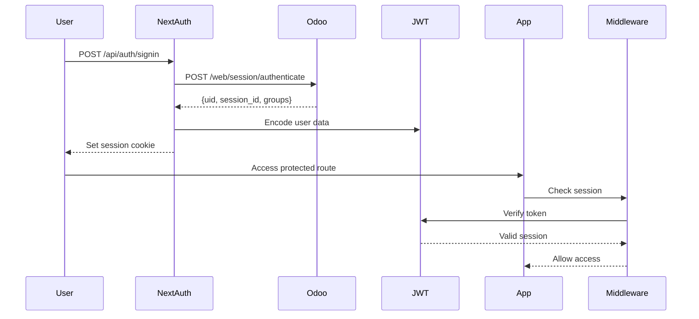

# Technical Architecture - Factory Frontend

## 1. Session Management - Đề xuất

### Option A: NextAuth.js với Custom Odoo Provider ⭐ **ĐỀ XUẤT**

**Kiến trúc:**
```
User → Login Form → NextAuth.js → Custom Odoo Provider
                                        ↓
                                   Odoo /web/session/authenticate
                                        ↓
                                   Return UID + Session Info
                                        ↓
                                   Store in JWT/Database Session
                                        ↓
                                   Set secure cookie
```

**Ưu điểm:**
- ✅ Standard authentication pattern cho Next.js
- ✅ Built-in CSRF protection
- ✅ Automatic session refresh
- ✅ Support multiple providers (future expansion)
- ✅ Secure cookie management
- ✅ TypeScript support tốt

**Nhược điểm:**
- ⚠️ Cần implement custom provider
- ⚠️ Learning curve nếu chưa quen NextAuth

**Implementation:**
```typescript
// lib/auth/odoo-provider.ts
import type { OAuthConfig } from "next-auth/providers"

export function OdooProvider(config: {
  odooUrl: string
  odooDb: string
}): OAuthConfig<any> {
  return {
    id: "odoo",
    name: "Odoo",
    type: "oauth",
    async authorize(credentials: { username: string; password: string }) {
      const response = await fetch(`${config.odooUrl}/web/session/authenticate`, {
        method: "POST",
        headers: { "Content-Type": "application/json" },
        body: JSON.stringify({
          jsonrpc: "2.0",
          params: {
            db: config.odooDb,
            login: credentials.username,
            password: credentials.password,
          },
        }),
      })

      const data = await response.json()

      if (data.result && data.result.uid) {
        return {
          id: data.result.uid,
          name: data.result.name,
          email: data.result.username,
          odooSessionId: data.result.session_id,
          odooContext: data.result.user_context,
          groups: data.result.groups, // For authorization
        }
      }
      return null
    },
  }
}

// app/api/auth/[...nextauth]/route.ts
import NextAuth from "next-auth"
import { OdooProvider } from "@/lib/auth/odoo-provider"

export const { handlers, auth, signIn, signOut } = NextAuth({
  providers: [
    OdooProvider({
      odooUrl: process.env.ODOO_URL!,
      odooDb: process.env.ODOO_DB!,
    }),
  ],
  session: {
    strategy: "jwt", // or "database" for production
    maxAge: 8 * 60 * 60, // 8 hours (work shift)
  },
  callbacks: {
    async jwt({ token, user }) {
      if (user) {
        token.uid = user.id
        token.odooSessionId = user.odooSessionId
        token.groups = user.groups
      }
      return token
    },
    async session({ session, token }) {
      session.user.uid = token.uid
      session.user.groups = token.groups
      return session
    },
  },
})
```

---

### Option B: Custom Session với Odoo Session Cookie

**Kiến trúc:**
```
User → Login API Route → Odoo authenticate → Get session_id
                                                    ↓
                                            Store in Redis/Database
                                                    ↓
                                            Return httpOnly cookie
```

**Ưu điểm:**
- ✅ Direct Odoo session reuse
- ✅ Simpler architecture
- ✅ Real-time Odoo session sync

**Nhược điểm:**
- ⚠️ Need Redis/Database for session store
- ⚠️ Manual CSRF protection
- ⚠️ More security considerations

---

### **Quyết định: Option A - NextAuth.js**
Vì project cần scale, security tốt, và có thể mở rộng thêm providers sau này.

---

## 2. Odoo 18 API Integration

### Authentication Flow



### API Endpoints Structure

```typescript
// lib/odoo/client.ts
export class OdooClient {
  private baseUrl: string
  private db: string
  private sessionId: string | null

  constructor(sessionId?: string) {
    this.baseUrl = process.env.ODOO_URL!
    this.db = process.env.ODOO_DB!
    this.sessionId = sessionId || null
  }

  async call<T>(
    model: string,
    method: string,
    args: any[] = [],
    kwargs: Record<string, any> = {}
  ): Promise<T> {
    const response = await fetch(`${this.baseUrl}/web/dataset/call_kw`, {
      method: "POST",
      headers: {
        "Content-Type": "application/json",
        "Cookie": this.sessionId ? `session_id=${this.sessionId}` : "",
      },
      body: JSON.stringify({
        jsonrpc: "2.0",
        method: "call",
        params: {
          model,
          method,
          args,
          kwargs,
        },
      }),
    })

    const data = await response.json()
    if (data.error) {
      throw new Error(data.error.message)
    }
    return data.result
  }

  // Inventory methods
  async getStockLocations() {
    return this.call("stock.location", "search_read", [], {
      fields: ["name", "location_id", "usage", "barcode"],
      domain: [["usage", "in", ["internal", "view"]]],
    })
  }

  async getProducts(filters = {}) {
    return this.call("product.product", "search_read", [], {
      fields: ["name", "default_code", "barcode", "type", "uom_id", "qty_available"],
      ...filters,
    })
  }

  async getStockPicking(pickingId: number) {
    return this.call("stock.picking", "read", [[pickingId]], {
      fields: ["name", "partner_id", "location_id", "location_dest_id", "move_ids", "state"],
    })
  }

  async createStockPicking(data: StockPickingData) {
    return this.call("stock.picking", "create", [data])
  }

  async validatePicking(pickingId: number) {
    return this.call("stock.picking", "button_validate", [[pickingId]])
  }

  // Manufacturing methods
  async getMrpProductions(filters = {}) {
    return this.call("mrp.production", "search_read", [], {
      fields: ["name", "product_id", "product_qty", "date_planned_start", "state", "user_id"],
      ...filters,
    })
  }

  async getMrpProduction(productionId: number) {
    return this.call("mrp.production", "read", [[productionId]], {
      fields: ["name", "product_id", "bom_id", "product_qty", "move_raw_ids", "move_finished_ids", "workorder_ids", "state"],
    })
  }

  async startProduction(productionId: number) {
    return this.call("mrp.production", "button_plan", [[productionId]])
  }

  async markAsStarted(productionId: number) {
    return this.call("mrp.production", "button_mark_done", [[productionId]])
  }

  async getWorkOrders(filters = {}) {
    return this.call("mrp.workorder", "search_read", [], {
      fields: ["name", "production_id", "workcenter_id", "state", "date_planned_start"],
      ...filters,
    })
  }
}
```

---

## 3. Authorization & Permissions

### Odoo Groups Mapping

```typescript
// lib/auth/permissions.ts
export const PERMISSIONS = {
  INVENTORY: {
    VIEW: "stock.group_stock_user",
    MANAGE: "stock.group_stock_manager",
    ADMIN: "stock.group_stock_multi_locations",
  },
  MANUFACTURING: {
    VIEW: "mrp.group_mrp_user",
    MANAGE: "mrp.group_mrp_manager",
    ADMIN: "mrp.group_mrp_routings",
  },
} as const

export function hasPermission(
  userGroups: number[],
  requiredGroup: string
): boolean {
  // Check if user has required Odoo group
  // This will be populated from Odoo session
  return true // Implement based on Odoo group IDs
}

// Middleware usage
export async function checkPermission(
  session: Session,
  permission: string
) {
  if (!session?.user?.groups) {
    throw new Error("Unauthorized")
  }

  if (!hasPermission(session.user.groups, permission)) {
    throw new Error("Forbidden: Insufficient permissions")
  }
}
```

### Route Protection

```typescript
// middleware.ts
import { auth } from "@/lib/auth"
import { NextResponse } from "next/server"

export default auth((req) => {
  const { pathname } = req.nextUrl

  // Public routes
  if (pathname.startsWith("/login")) {
    return NextResponse.next()
  }

  // Protected routes
  if (!req.auth) {
    return NextResponse.redirect(new URL("/login", req.url))
  }

  // Role-based access
  if (pathname.startsWith("/inventory")) {
    if (!hasPermission(req.auth.user.groups, PERMISSIONS.INVENTORY.VIEW)) {
      return NextResponse.redirect(new URL("/unauthorized", req.url))
    }
  }

  return NextResponse.next()
})

export const config = {
  matcher: ["/((?!api|_next/static|_next/image|favicon.ico).*)"],
}
```

---

## 4. State Management Strategy

### Tanstack Query (React Query) cho Server State

```typescript
// hooks/useProducts.ts
import { useQuery, useMutation, useQueryClient } from "@tanstack/react-query"
import { odooApi } from "@/lib/odoo/api"

export function useProducts(filters = {}) {
  return useQuery({
    queryKey: ["products", filters],
    queryFn: () => odooApi.getProducts(filters),
    staleTime: 5 * 60 * 1000, // 5 minutes
    refetchOnWindowFocus: false,
  })
}

export function useUpdateProduct() {
  const queryClient = useQueryClient()

  return useMutation({
    mutationFn: (data: { id: number; updates: any }) =>
      odooApi.updateProduct(data.id, data.updates),
    onSuccess: () => {
      queryClient.invalidateQueries({ queryKey: ["products"] })
    },
  })
}
```

### Zustand cho UI State

```typescript
// stores/uiStore.ts
import { create } from "zustand"

interface UIState {
  sidebarOpen: boolean
  scannerActive: boolean
  selectedLocation: number | null
  setSidebarOpen: (open: boolean) => void
  toggleScanner: () => void
  setSelectedLocation: (id: number | null) => void
}

export const useUIStore = create<UIState>((set) => ({
  sidebarOpen: true,
  scannerActive: false,
  selectedLocation: null,
  setSidebarOpen: (open) => set({ sidebarOpen: open }),
  toggleScanner: () => set((state) => ({ scannerActive: !state.scannerActive })),
  setSelectedLocation: (id) => set({ selectedLocation: id }),
}))
```

---

## 5. Performance Optimization cho Tablet

### Code Splitting
```typescript
// app/(dashboard)/inventory/page.tsx
import dynamic from "next/dynamic"

const BarcodeScanner = dynamic(
  () => import("@/components/inventory/BarcodeScanner"),
  { ssr: false, loading: () => <p>Loading scanner...</p> }
)
```

### Image Optimization
```typescript
// next.config.ts
export default {
  images: {
    formats: ["image/avif", "image/webp"],
    deviceSizes: [768, 1024, 1280], // Tablet sizes
  },
}
```

### Bundle Size Monitoring
```json
// package.json
{
  "scripts": {
    "analyze": "ANALYZE=true next build"
  }
}
```

---

## 6. Offline Support (PWA)

### Service Worker Setup
```typescript
// public/sw.js
self.addEventListener("fetch", (event) => {
  event.respondWith(
    caches.match(event.request).then((response) => {
      return response || fetch(event.request)
    })
  )
})
```

### Manifest
```json
// public/manifest.json
{
  "name": "Factory Management",
  "short_name": "Factory",
  "description": "Inventory & Manufacturing Management",
  "start_url": "/",
  "display": "standalone",
  "orientation": "any",
  "theme_color": "#3b82f6",
  "icons": [
    {
      "src": "/icon-192.png",
      "sizes": "192x192",
      "type": "image/png"
    }
  ]
}
```

---

## 7. Security Checklist

- [x] HTTPS only in production
- [x] HttpOnly cookies for session
- [x] CSRF protection (NextAuth built-in)
- [x] XSS protection (React escaping + CSP headers)
- [x] SQL Injection protection (Odoo ORM)
- [x] Rate limiting on API routes
- [x] Input validation (Zod schemas)
- [x] Secure environment variables
- [x] Session timeout (8 hours)
- [x] Permission checks on every API call

---

## Next: UI/UX Design Guidelines
See `02-ui-ux-design.md` for tablet-optimized interface specifications.
